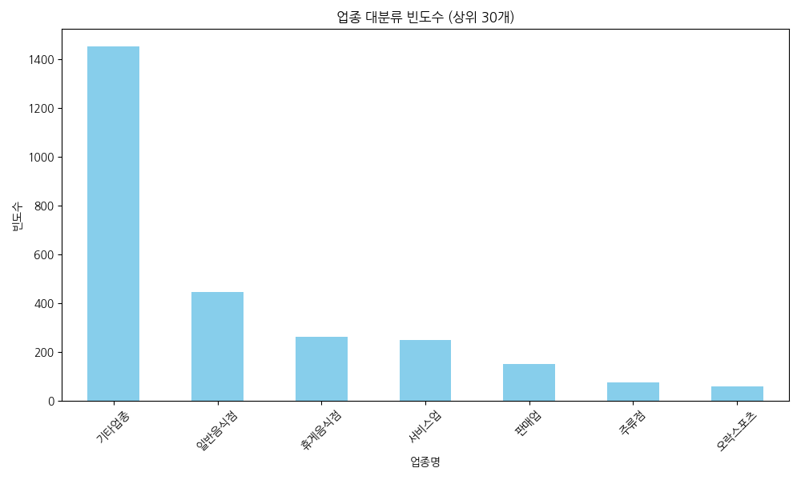
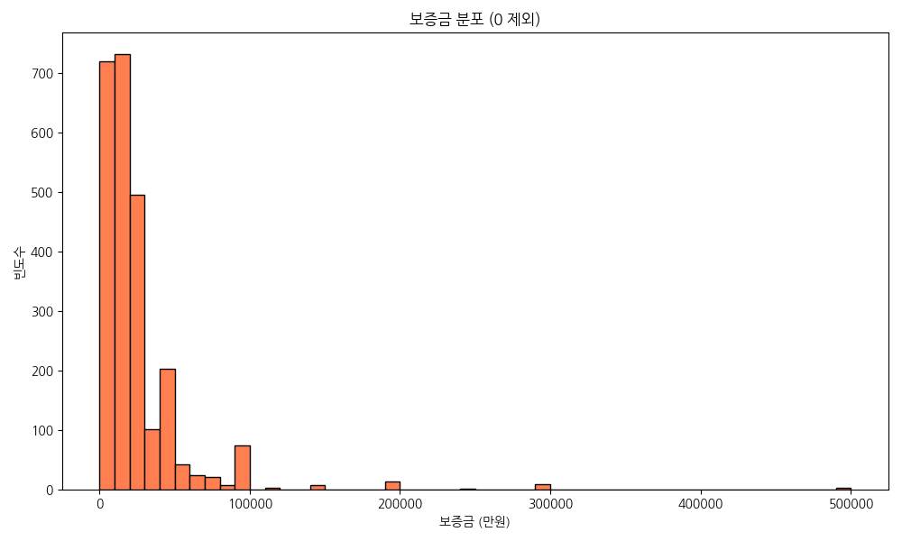
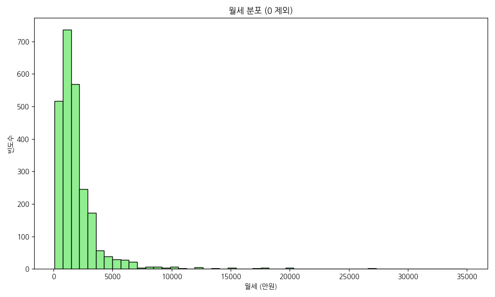
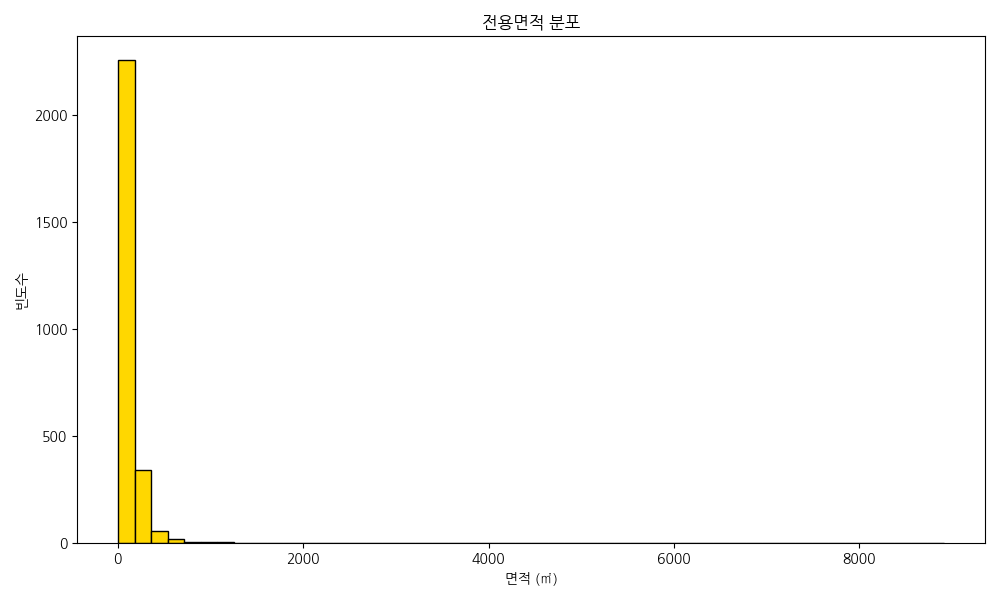
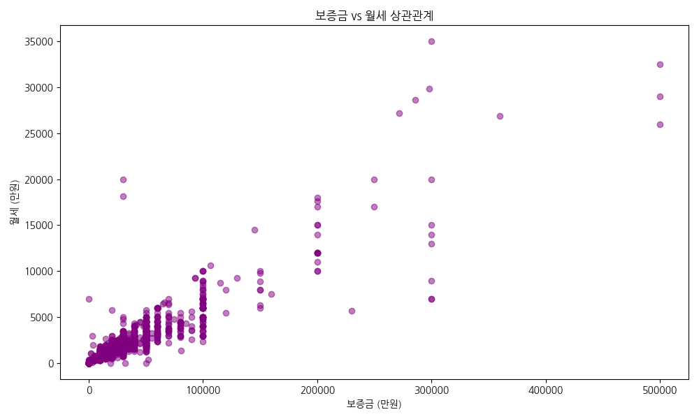
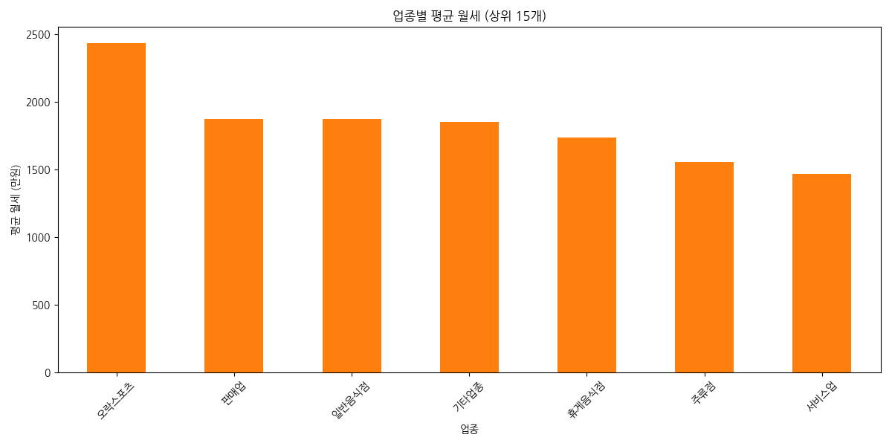
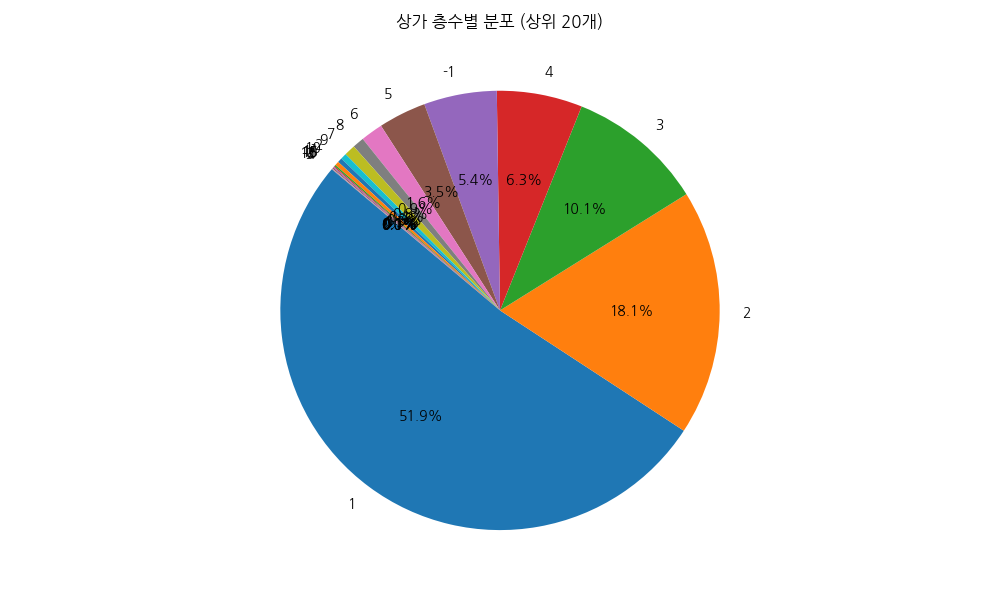
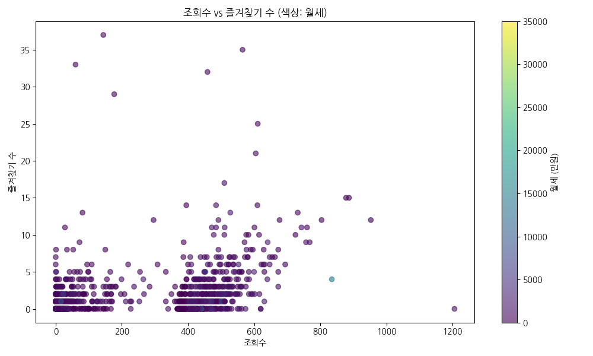
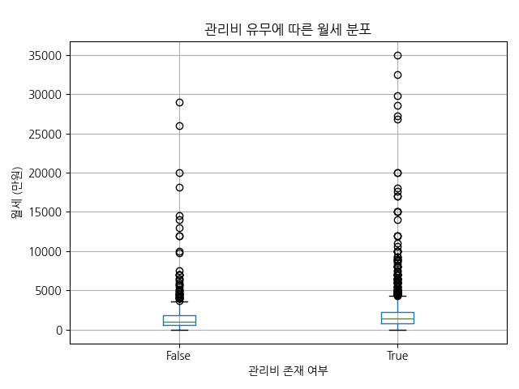
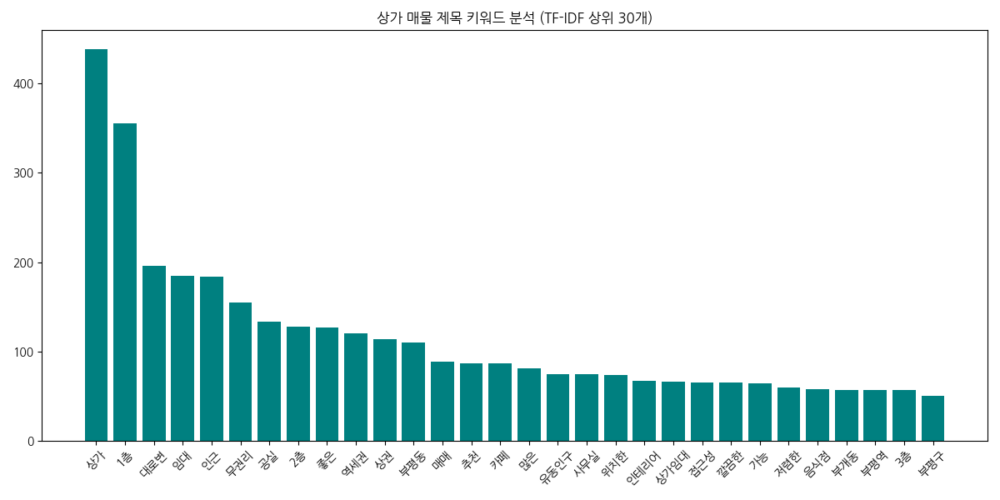

# Nemostore 상가 매물 데이터 EDA 보고서

## 1. 데이터 개요
- 전체 데이터 수: 2702 행
- 전체 컬럼 수: 41 개

### 데이터 샘플 (상위 5개)
|    | isPriority   |   articleType | id                                   |   buildingManagementSerialNumber | agentId   |   number | previewPhotoUrl                                                                  | smallPhotoUrls                                                                                                                                                                                                                                                                                                                                                                                                                                                                                                           | originPhotoUrls                                                                                                                                                                                                                                                                                                                                                                                                                                                                                                          |   businessLargeCode | businessLargeCodeName   |   businessMiddleCode | businessMiddleCodeName   |   priceType | priceTypeName   |   deposit |   monthlyRent | isPremiumClosed   |   premium |   sale |   maintenanceFee |   floor |   groundFloor |   size | title                               |   firstDeposit |   firstMonthlyRent |   firstPremium | confirmedDateUtc   | nearSubwayStation   |   viewCount |   favoriteCount | isInYourFavorited   | isMoveInDate   | moveInDate   | completionConfirmedDateUtc       | createdDateUtc                   | editedDateUtc                    |   state |   areaPrice | hasMaintenanceFee   |
|---:|:-------------|--------------:|:-------------------------------------|---------------------------------:|:----------|---------:|:---------------------------------------------------------------------------------|:-------------------------------------------------------------------------------------------------------------------------------------------------------------------------------------------------------------------------------------------------------------------------------------------------------------------------------------------------------------------------------------------------------------------------------------------------------------------------------------------------------------------------|:-------------------------------------------------------------------------------------------------------------------------------------------------------------------------------------------------------------------------------------------------------------------------------------------------------------------------------------------------------------------------------------------------------------------------------------------------------------------------------------------------------------------------|--------------------:|:------------------------|---------------------:|:-------------------------|------------:|:----------------|----------:|--------------:|:------------------|----------:|-------:|-----------------:|--------:|--------------:|-------:|:------------------------------------|---------------:|-------------------:|---------------:|:-------------------|:--------------------|------------:|----------------:|:--------------------|:---------------|:-------------|:---------------------------------|:---------------------------------|:---------------------------------|--------:|------------:|:--------------------|
|  0 | None         |             1 | a543bf4c-c21f-4d11-ba12-caddacf640bf |        2824510200110690003084821 | None      |   916114 | https://img.nemoapp.kr/article-photos/411d3490-546f-4b6d-954d-085fed766dcc/s.jpg | ['https://img.nemoapp.kr/article-photos/411d3490-546f-4b6d-954d-085fed766dcc/s.jpg', 'https://img.nemoapp.kr/article-photos/26ade3d7-63e9-4a18-82fc-560b3af85d85/s.jpg', 'https://img.nemoapp.kr/article-photos/b8187dfa-d2c2-44c1-8218-d498cc33c182/s.jpg', 'https://img.nemoapp.kr/article-photos/48a81583-ab58-472e-8bc5-e4159cc2c607/s.jpg', 'https://img.nemoapp.kr/article-photos/17923d04-d1e9-4967-8b10-f46cd257b6c8/s.jpg', 'https://img.nemoapp.kr/article-photos/98986874-9299-437f-aaa7-a84b74f6ea26/s.jpg'] | ['https://img.nemoapp.kr/article-photos/411d3490-546f-4b6d-954d-085fed766dcc/l.jpg', 'https://img.nemoapp.kr/article-photos/26ade3d7-63e9-4a18-82fc-560b3af85d85/l.jpg', 'https://img.nemoapp.kr/article-photos/b8187dfa-d2c2-44c1-8218-d498cc33c182/l.jpg', 'https://img.nemoapp.kr/article-photos/48a81583-ab58-472e-8bc5-e4159cc2c607/l.jpg', 'https://img.nemoapp.kr/article-photos/17923d04-d1e9-4967-8b10-f46cd257b6c8/l.jpg', 'https://img.nemoapp.kr/article-photos/98986874-9299-437f-aaa7-a84b74f6ea26/l.jpg'] |                  17 | 기타업종                    |                 1704 | 다용도점포                    |           1 | 임대              |     10000 |           600 | False             |         0 |      0 |               50 |       2 |             6 |  66.12 | 📍계산동 대로변 2층 상가임대                    |          10000 |                600 |              0 | None               | 계산역, 도보 14분         |          18 |               1 | None                | True           | None         | 2026-03-09T10:38:31.807792+00:00 | 2025-12-06T04:58:35.696818+00:00 | 2026-03-09T10:46:02.306718+00:00 |       1 |          32 | True                |
|  1 | None         |             1 | 52f1790e-26ca-4847-ba47-f2080b2db50d |        2823710100104330091110311 | None      |   917593 | https://img.nemoapp.kr/article-photos/50db7aad-a769-4bd8-8b3b-8cebb7075827/s.jpg | ['https://img.nemoapp.kr/article-photos/50db7aad-a769-4bd8-8b3b-8cebb7075827/s.jpg', 'https://img.nemoapp.kr/article-photos/c9eb9455-8228-4d33-9acd-2e811eb7af21/s.jpg', 'https://img.nemoapp.kr/article-photos/dfdbb41a-ea2f-4e3f-9ff2-7d26eb0c4991/s.jpg', 'https://img.nemoapp.kr/article-photos/60022520-2036-4ccf-a820-b8bd31a7e5b3/s.jpg', 'https://img.nemoapp.kr/article-photos/20e46167-418b-4bc9-9ec3-9851de26024e/s.jpg']                                                                                     | ['https://img.nemoapp.kr/article-photos/50db7aad-a769-4bd8-8b3b-8cebb7075827/l.jpg', 'https://img.nemoapp.kr/article-photos/c9eb9455-8228-4d33-9acd-2e811eb7af21/l.jpg', 'https://img.nemoapp.kr/article-photos/dfdbb41a-ea2f-4e3f-9ff2-7d26eb0c4991/l.jpg', 'https://img.nemoapp.kr/article-photos/60022520-2036-4ccf-a820-b8bd31a7e5b3/l.jpg', 'https://img.nemoapp.kr/article-photos/20e46167-418b-4bc9-9ec3-9851de26024e/l.jpg']                                                                                     |                  17 | 기타업종                    |                 1704 | 다용도점포                    |           3 | 매매              |         0 |             0 | False             |         0 | 380000 |              120 |       1 |             5 |  25.35 | 🌟🌟부평구청역 인근 현재 공실로 자가사용 가능한 매물입니다.🌟🌟 |              0 |                  0 |              0 | None               | 부평시장역, 도보 8분        |           0 |               0 | None                | True           | None         | 2026-03-09T10:41:12.575489+00:00 | 2025-12-13T01:15:25.567748+00:00 | 2026-03-09T10:46:00.652418+00:00 |       1 |       49554 | True                |
|  2 | None         |             1 | 60f04f78-53c1-4ae7-ae52-56039124235e |        2823710100105290015010071 | None      |   917325 | https://img.nemoapp.kr/article-photos/bea25e71-08db-4b1f-970e-fd1db2b824a5/s.jpg | ['https://img.nemoapp.kr/article-photos/bea25e71-08db-4b1f-970e-fd1db2b824a5/s.jpg', 'https://img.nemoapp.kr/article-photos/02c1e476-7f7f-4d8f-9b80-d51bb2446326/s.jpg', 'https://img.nemoapp.kr/article-photos/b4441db2-72e2-4c88-9dd7-570332e09c4a/s.jpg', 'https://img.nemoapp.kr/article-photos/dc74721d-b41a-4f97-847a-87434ba450a2/s.jpg', 'https://img.nemoapp.kr/article-photos/b1ee7bd4-d23c-438b-bb98-24f60c8cf19a/s.jpg']                                                                                     | ['https://img.nemoapp.kr/article-photos/bea25e71-08db-4b1f-970e-fd1db2b824a5/l.jpg', 'https://img.nemoapp.kr/article-photos/02c1e476-7f7f-4d8f-9b80-d51bb2446326/l.jpg', 'https://img.nemoapp.kr/article-photos/b4441db2-72e2-4c88-9dd7-570332e09c4a/l.jpg', 'https://img.nemoapp.kr/article-photos/dc74721d-b41a-4f97-847a-87434ba450a2/l.jpg', 'https://img.nemoapp.kr/article-photos/b1ee7bd4-d23c-438b-bb98-24f60c8cf19a/l.jpg']                                                                                     |                  17 | 기타업종                    |                 1704 | 다용도점포                    |           1 | 임대              |     66250 |          6630 | False             |         0 |      0 |             3210 |       1 |            17 | 162.94 | 🌟🌟부평시장역 초역세권 1층 핵심입지 🌟🌟             |          66250 |               6630 |              0 | None               | 부평시장역, 도보 1분        |           0 |               0 | None                | True           | None         | 2026-03-09T10:41:18.076781+00:00 | 2025-12-11T08:19:48.676438+00:00 | 2026-03-09T10:45:59.458437+00:00 |       1 |         140 | True                |
|  3 | None         |             1 | dce1be80-11e8-4501-ba36-a42e064adbb6 |        2823710800101080012204562 | None      |   916846 | https://img.nemoapp.kr/article-photos/e43d09e4-1215-4475-8434-f98e0720c508/s.jpg | ['https://img.nemoapp.kr/article-photos/e43d09e4-1215-4475-8434-f98e0720c508/s.jpg', 'https://img.nemoapp.kr/article-photos/3659d2f2-3055-4d49-84bf-e96d9d066f44/s.jpg', 'https://img.nemoapp.kr/article-photos/15bae0cb-2fd0-4542-b82f-cc11fbfbe812/s.jpg', 'https://img.nemoapp.kr/article-photos/e3021d80-8345-44aa-a7f7-bff4647473bb/s.jpg', 'https://img.nemoapp.kr/article-photos/df009906-98e6-4847-a563-ca1af0e94a78/s.jpg', 'https://img.nemoapp.kr/article-photos/f7b7ef45-9598-4061-b92e-1dc25701ae85/s.jpg'] | ['https://img.nemoapp.kr/article-photos/e43d09e4-1215-4475-8434-f98e0720c508/l.jpg', 'https://img.nemoapp.kr/article-photos/3659d2f2-3055-4d49-84bf-e96d9d066f44/l.jpg', 'https://img.nemoapp.kr/article-photos/15bae0cb-2fd0-4542-b82f-cc11fbfbe812/l.jpg', 'https://img.nemoapp.kr/article-photos/e3021d80-8345-44aa-a7f7-bff4647473bb/l.jpg', 'https://img.nemoapp.kr/article-photos/df009906-98e6-4847-a563-ca1af0e94a78/l.jpg', 'https://img.nemoapp.kr/article-photos/f7b7ef45-9598-4061-b92e-1dc25701ae85/l.jpg'] |                  17 | 기타업종                    |                 1704 | 다용도점포                    |           1 | 임대              |     20000 |          1500 | False             |         0 |      0 |              300 |      -1 |             4 | 325.19 | 🌟🌟지하 단독공간, 엘리베이터 직통!🌟🌟              |          20000 |               1500 |              0 | None               | 부개역, 도보 10분         |           0 |               0 | None                | True           | None         | 2026-03-09T10:42:02.101773+00:00 | 2025-12-09T05:20:02.314869+00:00 | 2026-03-09T10:45:58.224737+00:00 |       1 |          16 | True                |
|  4 | None         |             1 | eba505d7-d919-4291-a2cc-df684ededbe8 |        2823710700101390010108439 | None      |   915803 | https://img.nemoapp.kr/article-photos/d7af8059-ddf6-4e8b-b0cb-243b39737d58/s.jpg | ['https://img.nemoapp.kr/article-photos/d7af8059-ddf6-4e8b-b0cb-243b39737d58/s.jpg', 'https://img.nemoapp.kr/article-photos/29dff042-7327-4994-a15d-a2a3aeab0031/s.jpg', 'https://img.nemoapp.kr/article-photos/5db83c9a-e669-4196-8125-1917af8e0da7/s.jpg', 'https://img.nemoapp.kr/article-photos/79ef92cf-30a8-45bf-b4dc-fb59ef8cea62/s.jpg', 'https://img.nemoapp.kr/article-photos/41557892-9f57-48ae-86b9-c31f944e6f9c/s.jpg']                                                                                     | ['https://img.nemoapp.kr/article-photos/d7af8059-ddf6-4e8b-b0cb-243b39737d58/l.jpg', 'https://img.nemoapp.kr/article-photos/29dff042-7327-4994-a15d-a2a3aeab0031/l.jpg', 'https://img.nemoapp.kr/article-photos/5db83c9a-e669-4196-8125-1917af8e0da7/l.jpg', 'https://img.nemoapp.kr/article-photos/79ef92cf-30a8-45bf-b4dc-fb59ef8cea62/l.jpg', 'https://img.nemoapp.kr/article-photos/41557892-9f57-48ae-86b9-c31f944e6f9c/l.jpg']                                                                                     |                  17 | 기타업종                    |                 1704 | 다용도점포                    |           1 | 임대              |     20000 |           900 | False             |         0 |      0 |               20 |       2 |             3 |  95.87 | 🌟🌟부평해모로 앞 코너공실🌟🌟                    |          20000 |                900 |              0 | None               | 부개역, 도보 13분         |           0 |               0 | None                | True           | None         | 2026-03-09T10:42:04.312611+00:00 | 2025-12-05T01:16:59.448505+00:00 | 2026-03-09T10:45:57.02604+00:00  |       1 |          34 | True                |

## 업종 대분류 빈도수 분석

### 분석 및 해석
수집된 상가 데이터의 업종 대분류 분포를 파악한 결과, 특정 업종이 높은 비중을 차지하고 있음을 알 수 있습니다. 이는 해당 지역의 주요 상권 형성 특징을 보여줍니다.

### 주요 수치
| businessLargeCodeName   |   count |
|:------------------------|--------:|
| 기타업종                    |    1454 |
| 일반음식점                   |     447 |
| 휴게음식점                   |     263 |
| 서비스업                    |     250 |
| 판매업                     |     152 |
| 주류점                     |      76 |
| 오락스포츠                   |      60 |

---

## 보증금 분포 분석

### 분석 및 해석
보증금의 분포를 확인해본 결과, 대다수의 매물이 특정 가격대에 밀집되어 있으며 소수의 고가 매물이 존재함을 알 수 있습니다. 이는 일반적인 상가 임대 시장의 가격 형성을 반영합니다.

### 주요 수치
|       |   deposit |
|:------|----------:|
| count |    2702   |
| mean  |   27179.7 |
| std   |   35937   |
| min   |       0   |
| 25%   |   10000   |
| 50%   |   20000   |
| 75%   |   30000   |
| max   |  500000   |

---

## 월세 분포 분석

### 분석 및 해석
월세 분포는 보증금과 유사한 양상을 보이며, 중소형 상가들이 주를 이루는 시장 구조를 보여줍니다. 가격 변동폭이 커 다양한 규모의 상가가 공존함을 알 수 있습니다.

### 주요 수치
|       |   monthlyRent |
|:------|--------------:|
| count |       2702    |
| mean  |       1813.18 |
| std   |       2423.08 |
| min   |          0    |
| 25%   |        700    |
| 50%   |       1300    |
| 75%   |       2030    |
| max   |      35000    |

---

## 전용면적 분포 분석

### 분석 및 해석
상가의 전용면적은 소형(약 33㎡ 내외) 매물이 가장 높은 빈도를 보입니다. 이는 1인 창업이나 소규모 매장이 활발한 현재의 상권 트렌드와 일치합니다.

### 주요 수치
|       |     size |
|:------|---------:|
| count | 2702     |
| mean  |  122.432 |
| std   |  235.451 |
| min   |    6.72  |
| 25%   |   42.98  |
| 50%   |   78.66  |
| 75%   |  142.15  |
| max   | 8909.09  |

---

## 보증금과 월세의 상관관계 분석

### 분석 및 해석
보증금과 월세 사이에는 뚜렷한 양의 상관관계가 나타납니다. 즉, 보증금이 높은 매물일수록 월세도 높게 책정되는 경향이 강하며, 이는 매물의 가치가 가격 전반에 반영됨을 뜻합니다.

### 주요 수치
|             |   deposit |   monthlyRent |
|:------------|----------:|--------------:|
| deposit     |  1        |      0.899964 |
| monthlyRent |  0.899964 |      1        |

---

## 업종별 평균 월세 분석

### 분석 및 해석
특정 업종(예: 업무시설, 대형 판매시설 등)이 타 업종에 비해 평균 월세가 월등히 높게 나타납니다. 이는 공간의 입지 조건과 수익 구조 차이에서 비롯된 것으로 분석됩니다.

### 주요 수치
| businessLargeCodeName   |   monthlyRent |
|:------------------------|--------------:|
| 오락스포츠                   |       2432.83 |
| 판매업                     |       1872.63 |
| 일반음식점                   |       1870.63 |
| 기타업종                    |       1850.65 |
| 휴게음식점                   |       1738.4  |
| 주류점                     |       1553.42 |
| 서비스업                    |       1465.32 |

---

## 상가 층수별 분포 분석

### 분석 및 해석
1층 상가 매물이 압도적으로 많은 비중을 차지하고 있습니다. 이는 고객 접근성을 중시하는 상가 임대 시장의 특성이 고스란히 반영된 결과로 보입니다.

### 주요 수치
|   floor |   count |
|--------:|--------:|
|       1 |    1402 |
|       2 |     489 |
|       3 |     272 |
|       4 |     170 |
|      -1 |     145 |
|       5 |      95 |
|       6 |      44 |
|       8 |      23 |
|       7 |      22 |
|       9 |      12 |
|      -2 |       9 |
|      10 |       8 |
|      11 |       3 |
|      15 |       2 |
|       0 |       2 |
|      12 |       2 |
|      -4 |       1 |
|      -3 |       1 |

---

## 관심도(조회/즐겨찾기)와 가격의 상관관계

### 분석 및 해석
조회수가 높은 매물이 반드시 즐겨찾기 수가 많은 것은 아니지만, 일정한 비례 관계를 보입니다. 특히 중저가 매물에서 높은 관심도가 나타나는 경향을 확인할 수 있습니다.

### 주요 수치
|               |   viewCount |   favoriteCount |   monthlyRent |
|:--------------|------------:|----------------:|--------------:|
| viewCount     |   1         |        0.435501 |    -0.0671966 |
| favoriteCount |   0.435501  |        1        |    -0.100622  |
| monthlyRent   |  -0.0671966 |       -0.100622 |     1         |

---

## 관리비 존재 여부에 따른 월세 비교

### 분석 및 해석
관리비가 책정된 상가의 월세가 그렇지 않은 상가보다 중앙값이 높게 나타납니다. 이는 규모가 크거나 관리가 잘 되는 프라임급 빌딩의 매물일 가능성을 시사합니다.

### 주요 수치
| hasMaintenanceFee   |   count |    mean |     std |   min |   25% |   50% |   75% |   max |
|:--------------------|--------:|--------:|--------:|------:|------:|------:|------:|------:|
| False               |     783 | 1547.39 | 2236.89 |     0 |   600 |  1000 |  1800 | 29000 |
| True                |    1919 | 1921.63 | 2487.48 |     0 |   800 |  1450 |  2200 | 35000 |

---

## 매물 제목 키워드 주요 트렌드 분석

### 분석 및 해석
TF-IDF를 활용해 제목의 주요 키워드를 추출한 결과, '임대', '상가', '사무실' 등 목적성 명사가 주를 이룹니다. 또한 특정 지역 명칭이 강조되어 입지의 중요성을 어필하고 있습니다.

### 주요 수치
|    | Keyword   |    Score |
|---:|:----------|---------:|
|  0 | 상가        | 437.981  |
|  1 | 1층        | 355.52   |
|  2 | 대로변       | 196.165  |
|  3 | 임대        | 184.331  |
|  4 | 인근        | 183.384  |
|  5 | 무권리       | 155.345  |
|  6 | 공실        | 133.261  |
|  7 | 2층        | 127.742  |
|  8 | 좋은        | 127.169  |
|  9 | 역세권       | 120.546  |
| 10 | 상권        | 113.841  |
| 11 | 부평동       | 110.455  |
| 12 | 매매        |  88.9903 |
| 13 | 추천        |  87.2686 |
| 14 | 카페        |  86.5729 |
| 15 | 많은        |  81.5867 |
| 16 | 유동인구      |  74.768  |
| 17 | 사무실       |  74.2954 |
| 18 | 위치한       |  73.8272 |
| 19 | 인테리어      |  66.9687 |
| 20 | 상가임대      |  66.3032 |
| 21 | 접근성       |  65.2718 |
| 22 | 깔끔한       |  65.172  |
| 23 | 가능        |  64.8023 |
| 24 | 저렴한       |  59.6706 |
| 25 | 음식점       |  57.7643 |
| 26 | 부개동       |  57.0033 |
| 27 | 부평역       |  56.958  |
| 28 | 3층        |  56.7891 |
| 29 | 부평구       |  50.0894 |

---

